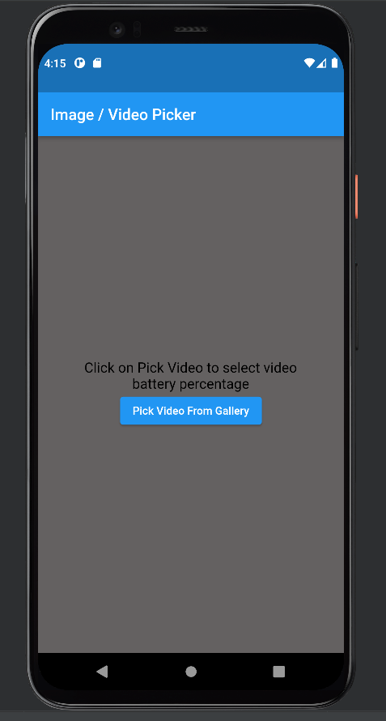
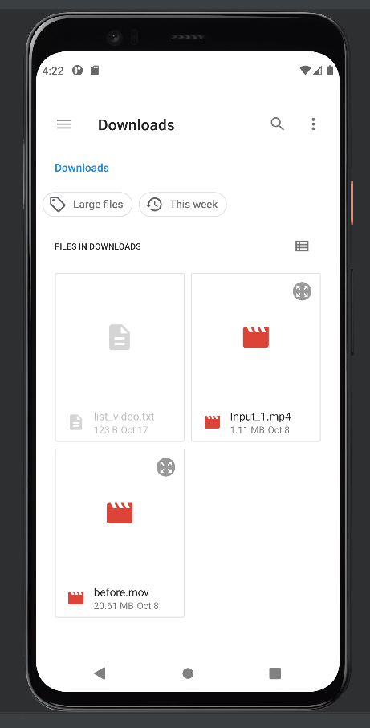
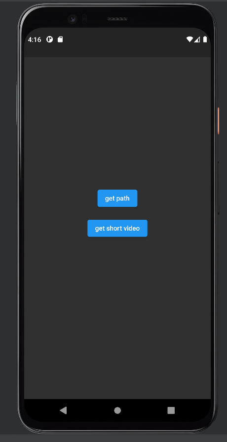
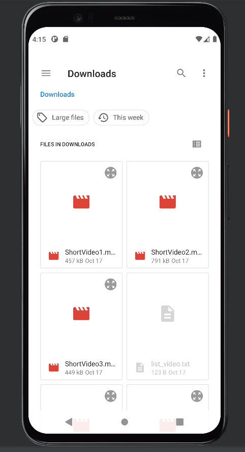

# ffmpeg_flutter_cut_slow_fast

## What is this?
This application cuts the video into 3 parts and alternately speeds up and slows them down.
This project was made to try the ffmpeg library

1. start page

2. pick video

3. push "get short video" button

4. 3 short video in path

## Getting Started

This project is a starting point for a Flutter application.

A few resources to get you started if this is your first Flutter project:

- [Lab: Write your first Flutter app](https://docs.flutter.dev/get-started/codelab)
- [Cookbook: Useful Flutter samples](https://docs.flutter.dev/cookbook)

For help getting started with Flutter development, view the
[online documentation](https://docs.flutter.dev/), which offers tutorials,
samples, guidance on mobile development, and a full API reference.
